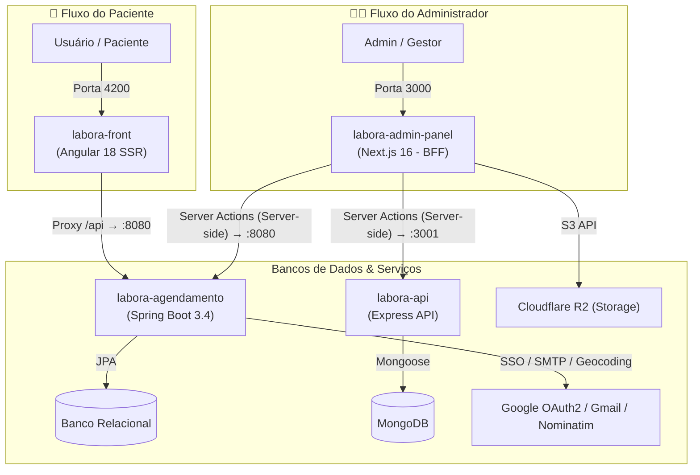

# 🧪 Labora — Monorepo

Bem-vindo ao **Labora**, um ecossistema completo para agendamento de consultas e exames laboratoriais. Este repositório é um monorepo que unifica as quatro frentes do projeto (dois frontends e dois backends), facilitando o desenvolvimento, controle de versão e entendimento da arquitetura.

---

## 🏗️ Visão Geral da Arquitetura

O sistema é dividido em responsabilidades bem delimitadas para os fluxos de **Pacientes** e **Administradores**:



---

## 💡 O que é um BFF (Backend-for-Frontend)?

No fluxo administrativo, o **labora-admin-panel** (Next.js) adota o padrão de arquitetura **BFF (Backend-for-Frontend)**.

### O Conceito
Um **BFF** é um serviço intermediário sob medida criado especificamente para atender às necessidades de uma interface de usuário específica (neste caso, o painel do administrador). 

Em arquiteturas tradicionais, o navegador do usuário faz requisições HTTP diretamente para múltiplos microsserviços e APIs. Com o BFF:
1. O navegador se comunica exclusivamente com o servidor do **Next.js** (na mesma origem).
2. O servidor do Next.js (rodando em ambiente seguro de backend) faz a orquestração e busca os dados necessários nas APIs internas (`labora-api` na porta 3001 e `labora-agendamento` na porta 8080).
3. O Next.js consolida as respostas e envia apenas o necessário de volta ao navegador.

### Vantagens do BFF no Projeto Labora
* **Segurança Robusta (HttpOnly Cookies):** O navegador nunca tem acesso direto aos tokens JWT das APIs de backend. O Next.js recebe os tokens e os salva em cookies criptografados e marcados como `HttpOnly`. O JavaScript do navegador fica blindado contra ataques XSS de roubo de sessão.
* **Orquestração de Dados:** Para gerar uma tela de relatório ou dashboard complexo, o BFF pode bater tanto no banco relacional (via Spring Boot) quanto no MongoDB (via Express API), combinar essas informações do lado do servidor (onde a rede é extremamente rápida) e entregar um payload único e otimizado ao frontend.
* **Menor Superfície de Ataque:** Nossas APIs de backend (`labora-api` e `labora-agendamento`) podem ficar protegidas em uma rede privada ou com acesso restrito, não precisando ficar totalmente expostas de forma pública na internet.

---

## 📂 Módulos do Projeto

O monorepo está organizado nas seguintes pastas:

### 1. [labora-front](./labora-front) (Frontend do Paciente)
Interface limpa e rápida voltada para o paciente realizar agendamentos.
* **Tecnologias:** Angular 18, TailwindCSS 3, NgRx (Gerenciamento de Estado), SSR (Server-Side Rendering).
* **Porta Padrão:** `4200`
* **Comunicação:** Utiliza um proxy reverso interno configurado em `proxy.conf.json` para direcionar requisições `/api` ao backend na porta `8080`.

### 2. [labora-agendamento](./labora-agendamento) (Backend de Agendamentos)
API principal que lida com as regras de negócio de agendamentos, usuários e clínicas.
* **Tecnologias:** Java 21, Spring Boot 3.4, Spring Security, Spring Data JPA, Hibernate Validator, Springdoc OpenAPI.
* **Serviços Externos:** Google SSO (OAuth2), Gmail SMTP (Notificações) e Nominatim API (Geocoding de endereços).
* **Porta Padrão:** `8080` (context-path: `/api`)

### 3. [labora-admin-panel](./labora-admin-panel) (Painel Administrativo - BFF)
Dashboard de controle para administradores dos laboratórios e filiais.
* **Tecnologias:** Next.js 16, React 19, TailwindCSS 4, Recharts (gráficos), Lucide React.
* **Integração de Mídia:** Cloudflare R2 (S3-compatible) para upload de laudos e arquivos.
* **Porta Padrão:** `3000`

### 4. [labora-api](./labora-api) (API Administrativa)
Serviço de apoio que gerencia filiais, laboratórios, dados analíticos e auditoria para os administradores.
* **Tecnologias:** Node.js, Express, TypeScript, Mongoose.
* **Banco de Dados:** MongoDB
* **Porta Padrão:** `3001`

---

## ⚙️ Mapeamento de Portas e Conexões

| Serviço | Porta | Tipo | Consome |
|---------|-------|------|---------|
| **labora-front** | `4200` | Angular SSR | → `8080` (labora-agendamento) |
| **labora-admin-panel** | `3000` | Next.js (BFF) | → `3001` (labora-api) e `8080` (labora-agendamento) |
| **labora-agendamento** | `8080` | Spring Boot REST | → Banco Relacional, APIs externas (Google, Nominatim) |
| **labora-api** | `3001` | Express REST | → MongoDB |

---

## 🚀 Como Executar o Projeto

Certifique-se de configurar os arquivos `.env` em cada uma das pastas seguindo os modelos `.env.example` disponíveis.

1. **Subir os Bancos de Dados** (conforme sua preferência de ambiente, local ou via Docker).
2. **Executar a API Principal (Spring Boot):**
   ```bash
   cd labora-agendamento
   ./mvnw spring-boot:run
   ```
3. **Executar a API de Administração (Express):**
   ```bash
   cd labora-api
   npm run dev
   ```
4. **Executar o Frontend do Paciente (Angular):**
   ```bash
   cd labora-front
   npm run start
   ```
5. **Executar o Painel de Administração (Next.js):**
   ```bash
   cd labora-admin-panel
   npm run dev
   ```
