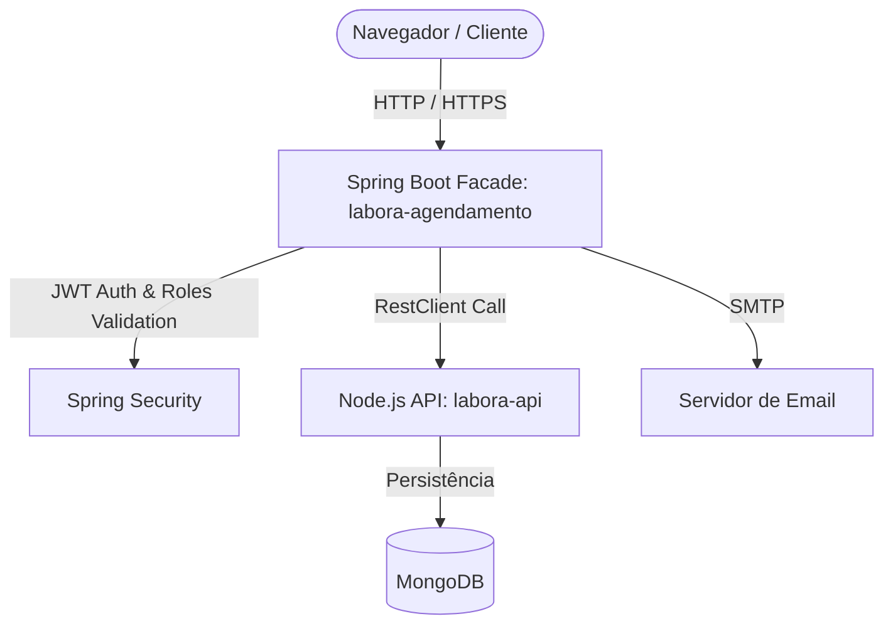

# 🔬 Labora - Módulo de Agendamentos (Spring Boot)

O **Labora Agendamento** é o módulo do ecossistema **Labora** responsável pela API de agendamento de exames laboratoriais.

Atualmente, ele funciona sob uma arquitetura de **Cliente Facade/Stateless Proxy**, delegando toda a persistência de banco de dados e lógica interna para o backend principal em Node.js/Express ([labora-api](file:///Users/evana/Projetos/Labora/labora-api)) conectado ao MongoDB. Ele gerencia autenticação stateless via tokens JWT, tratamento de emails de verificação e controle de acesso baseado em roles para pacientes.

---

## 📋 Funcionalidades Suportadas

- 🔐 **Autenticação Stateless**: Validação de JWT e decodificação stateless das claims para identificação e atribuição de roles do usuário.
- 📬 **Verificação de Conta**: Fluxo de ativação de conta com disparo de emails estilizados nas cores do projeto (Mint Green & Ciano) com links direcionando ao front-end.
- 🔬 **Visualização de Catálogos (Apenas Leitura)**:
  - Listagem e consulta de laboratórios (`GET /labs/**`)
  - Listagem e consulta de filiais (`GET /branches/**`) com busca por geolocalização baseada em raio (fórmula de Haversine)
  - Listagem e consulta de exames/testes (`GET /tests/**`)
- 📅 **Gestão de Agendamentos (CRUD Completo)**:
  - Criação, consulta, reagendamento e cancelamento de exames para o perfil de Paciente (`/schedule/**`)
- 👤 **Gerenciamento de Perfil**:
  - Consulta de perfil pessoal (`GET /me`) e alteração de senha segura.

---

## 🛠 Tecnologias Utilizadas

- **Java 21** & **Spring Boot 3.4.5**
- **Spring Security** (Autenticação JWT com hierarquia de papéis `RoleHierarchy`)
- **RestClient** (Para comunicação síncrona de alta performance com a API Node.js)
- **Jakarta Mail** (Para envio de emails transacionais)
- **ModelMapper** (Para conversão entre entidades e DTOs)
- **Docker & Docker Compose** (Para containerização e simplificação do deploy local)

---

## 🏗 Arquitetura

O ecossistema divide as responsabilidades da seguinte forma:



*Nota: Não há acoplamento direto com bancos de dados relacionais (PostgreSQL/Hibernate) ou migrações locais de banco (Flyway). Toda a manipulação de dados é feita via requisições REST à `labora-api`.*

---

## 🚀 Como Executar com Docker (Recomendado)

O projeto está totalmente dockerizado. Siga os passos abaixo para iniciar o serviço localmente:

### 1. Configurar as Variáveis de Ambiente
Crie um arquivo `.env` na raiz do projeto `labora-agendamento` baseando-se no exemplo abaixo:

```properties
LABORA_API_URL=http://host.docker.internal:3001
JWT_SECRET=seu-jwt-secret-de-64-caracteres
MAIL_USERNAME=seu-email@gmail.com
MAIL_PASSWORD=sua-senha-de-app-smtp
APP_FRONTEND_URL=http://localhost:4200
LABIFY_SSO_GOOGLE_CLIENT_ID=seu-google-client-id
LABIFY_SSO_GOOGLE_CLIENT_SECRET=seu-google-client-secret
```

### 2. Iniciar os Containers
Execute o comando a seguir para construir a imagem Java e levantar o container em modo background:

```bash
docker-compose up -d --build
```

A API estará disponível para acesso no host através de: `http://localhost:8080`

---

## ⚙️ Execução para Desenvolvimento Local (Maven)

Caso prefira executar sem o Docker:

1. Garanta que as variáveis de ambiente descritas acima estejam exportadas na sua sessão do terminal.
2. Compile o projeto:
   ```bash
   mvn clean install
   ```
3. Execute a aplicação Spring Boot:
   ```bash
   mvn spring-boot:run
   ```

---

## 📁 Estrutura do Projeto

- **api/controller**: Controladores REST contendo os endpoints expostos à aplicação.
- **api/dto**: Objetos de transferência de dados (DTOs) estruturados para comunicação segura.
- **api/service**: Camada de lógica de negócios que consome a API Node.js externa.
- **config**: Configurações de segurança, filtros JWT, criptografia de senhas e clientes HTTP.
- **domain**: Classes de modelo de domínio e enumerações (`Role`, `TestCategory`, etc.).
- **exception**: Gerenciador global de exceções e tratamento customizado de erros HTTP.

---

## 📄 Documentação da API

A documentação interativa OpenAPI/Swagger está habilitada e pode ser visualizada acessando:  
🔗 [http://localhost:8080/swagger-ui/index.html](http://localhost:8080/swagger-ui/index.html)
